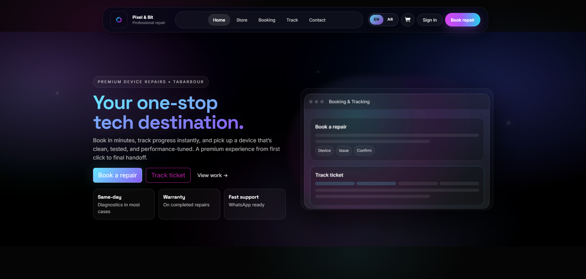

# Pixel & Bit

Pixel & Bit is a full-stack tech repair platform built with ASP.NET Core MVC.

Official Website: https://pixel-and-bit.com

## Features

- Device repair booking
- Order tracking
- Store / e-commerce services
- Admin dashboard
- Arabic / English support
- Responsive modern UI
- Dark neon tech design

## Tech Stack

- ASP.NET Core MVC (.NET 8)
- Entity Framework Core
- SQLite / SQL Server
- ASP.NET Identity
- Tailwind CSS
- Nginx
- Ubuntu VPS
- HTTPS with Let's Encrypt

## Architecture

The project follows a clean layered structure:

- PixelAndBit.Domain
- PixelAndBit.Application
- PixelAndBit.Infrastructure
- PixelAndBit.Web

## Deployment

The project is deployed on an Ubuntu VPS using:

- Nginx reverse proxy
- systemd service
- HTTPS certificate
- Custom domain

## Preview

